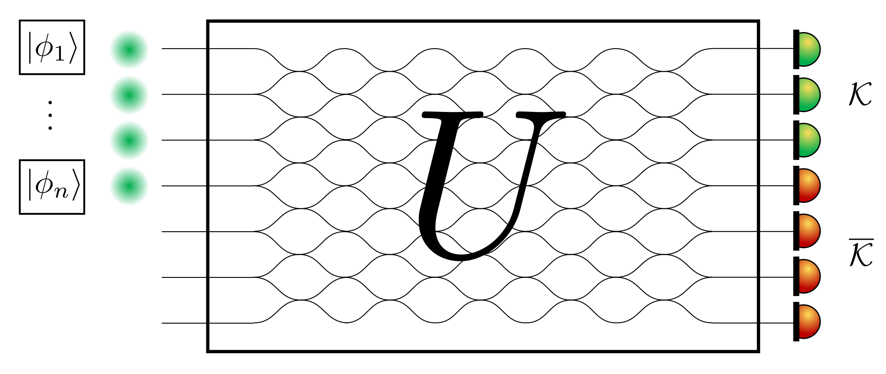

# Partitions of the output modes

One of the novel tools presented in this package relates the to calculation of photon counts in partition of the output modes, made by grouping output modes into bins.

The simplest example would be a subset ```K```, as represented below. More intricate partitions can be considered, with bins ```K_1,K_2...```.



The subset ```K``` can gather from 0 to `n` photons. The authors developed new theoretical tools allowing for the efficient computation of this probability distribution, and more refined ones.

## Subsets

Let us now guide you through how to use this package to compute these quantities.

Subsets are defined as follow

    s1 = Subset([1,1,0,0,0])

By construction, we do not allow for Susbets to overlap (although there is no theoretical limitation, it is inefficient and messy in practice if considering photon conservation). This can be checked as follow

    s1 = Subset([1,1,0,0,0])
    s2 = Subset([0,0,1,1,0])
    s3 = Subset([1,0,1,0,0])

    check_subset_overlap([s1,s2,s3]) # will fail

## Partitions

### Basic definitions

Consider now the case of partition of the output modes. A partition is composed of multiple subsets. Consider for instance the Hong-Ou-Mandel effect, where we will take the first mode as the first subset, and likewise for the second. (Note that in general subsets will span more than one mode.)

    n = 2
    m = 2

    input_state = Input{Bosonic}(first_modes(n,m))

    set1 = [1,0]
    set2 = [0,1]
    physical_interferometer = Fourier(m)
    part = Partition([Subset(set1), Subset(set2)])

A partition can either span all modes or not (such as the above subset). This can be checked with

    occupies_all_modes(part)

### Direct output

One can directly compute the various probabilities of photon counts through

    (physical_indexes, pdf) = compute_probabilities_partition(physical_interferometer, part, input_state)

    print_pdfs(physical_indexes, pdf,n; partition_spans_all_modes = true, physical_events_only = true)

### Single partition output with Event

And alternative, cleaner way is to use the formalism of an [`Event`](@ref). For this we present an example with another setup, where subsets span multiple modes and the partition is incomplete

      n = 2
      m = 5

      s1 = Subset([1,1,0,0,0])
      s2 = Subset([0,0,1,1,0])

      part = Partition([s1,s2])

We can choose to observe the probability of a single, specific output pattern. In this case, let's choose the case where we find two photons in the first bin, and no photons in the second. We define a [`PartitionOccupancy`](@ref) to represent this data

    part_occ = PartitionOccupancy(ModeOccupation([2,0]),n,part)

And now let's compute this probability

    i = Input{Bosonic}(first_modes(n,m))
    o = PartitionCount(part_occ)
    interf = RandHaar(m)
    ev = Event(i,o,interf)

    compute_probability!(ev)

### All possible partition patterns

More generally, one will be interested in the probabilities of all possible outputs. This is done as follows

    o = PartitionCountsAll(part)
    ev = Event(i,o,interf)

    compute_probability!(ev)
